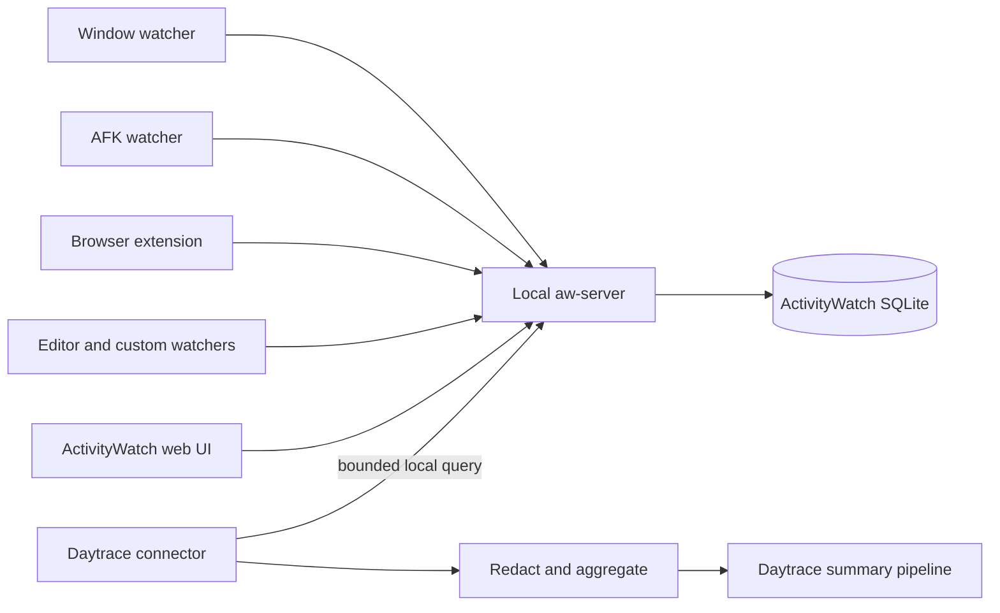

# ActivityWatch integration research

Status: recommended for implementation as an optional integration

Research date: 2026-08-27

Scope: use ActivityWatch data to create Daytrace summaries; no ActivityWatch
collection or storage replacement

## Executive conclusion

Daytrace can integrate cleanly with ActivityWatch. The recommended first
integration is a native, read-only-in-practice connector to the local
ActivityWatch REST API. It should request bounded, AFK-filtered canonical
activity for one device/day, aggregate and redact it inside Daytrace, and feed
the result into Daytrace's existing summary pipeline.

Do not bundle ActivityWatch, fork its server, read its SQLite database directly,
or copy its Python stack into Daytrace. Do not write a Daytrace watcher or
publish summaries back into ActivityWatch in the first version. Those options
add lifecycle, licensing, corruption, and security costs without improving the
summary use case.

Two user modes are useful:

- **Linked summaries (default):** query ActivityWatch on demand or at the
  scheduled summary time. Daytrace stores the final summary, generation
  metadata, safe aggregate totals, and evidence fingerprints—not raw
  ActivityWatch titles or events.
- **Import into journal (later, explicit):** persist a sanitized Daytrace text
  projection for local search and cross-source timelines. This duplicates
  sensitive data and therefore needs separate retention and deletion controls.

The integration is technically small, but there are important caveats:

- ActivityWatch's `/api/0` API is documented as unfinished and subject to
  change.
- Current stable and development versions differ around optional API-key
  authentication.
- The official Rust client is marked WIP.
- ActivityWatch's default localhost API historically has no per-client or
  read-only authorization scope.
- Current canonical-query implementations operate on a single host. Daytrace
  must query hosts separately and merge intervals itself.
- ActivityWatch stores UTC timestamps and discards the original UTC offset, so
  historic local time cannot always be reconstructed after travel.
- Window titles, URLs, filenames, and chat subjects can be highly sensitive;
  ActivityWatch's general capture filtering is still documented as planned.

None of these blocks a safe local integration if Daytrace uses a narrow client,
version detection, bounded queries, conservative redaction, and fixtures rather
than a developer's real activity in tests.

## Upstream snapshot studied

The study used official documentation and these upstream `master` snapshots:

| Repository | Commit studied | Purpose |
|---|---|---|
| `ActivityWatch/docs` | `78f0d85e3f7774a65551f96408e7b8ae8048dce8` | architecture, data model, API, AI workflow, security |
| `ActivityWatch/aw-client` | `101b8039957c56265d4f8779683b7c1322fa8806` | Python canonical-query reference and examples |
| `ActivityWatch/aw-server-rust` | `840d11c9cb97b1485a60fe77fdbca6537b508eda` | current endpoints, Rust models/client, authentication |
| `ActivityWatch/activitywatch` | `115e49e111cd0a248be6230680544235ae3a5a8e` | bundle, component topology, licensing |

As of the research date, GitHub lists `v0.13.2` as the latest stable release and
`v0.14.0b1` as a prerelease. The source is moving, so implementation should pin
compatibility fixtures to released versions rather than target `master` alone.

ActivityWatch is open source under MPL-2.0. Calling its documented REST API does
not require copying its source. If Daytrace later vendors or modifies
`aw-client-rust`, the MPL file-level source obligations and notices need a legal
and dependency review.

Primary upstream references:

- [ActivityWatch repository and architecture](https://github.com/ActivityWatch/activitywatch)
- [ActivityWatch releases](https://github.com/ActivityWatch/activitywatch/releases)
- [Architecture documentation](https://docs.activitywatch.net/en/latest/architecture.html)
- [Buckets and events](https://docs.activitywatch.net/en/latest/buckets-and-events.html)
- [Working with ActivityWatch data](https://docs.activitywatch.net/en/latest/examples/working-with-data.html)
- [ActivityWatch with agents and AI](https://docs.activitywatch.net/en/latest/examples/agents-and-ai.html)
- [REST API](https://docs.activitywatch.net/en/latest/api/rest.html)
- [Security notes](https://docs.activitywatch.net/en/latest/security.html)

## What ActivityWatch provides

ActivityWatch is a local-first automated time tracker composed of independent
processes:



The server does not collect activity itself. Watchers send events to buckets,
normally one bucket per watcher and host. The standard desktop bundle includes:

- `aw-watcher-window`: active application and window title; some current
  implementations can also expose the browser URL;
- `aw-watcher-afk`: `afk` / `not-afk`, normally based on three minutes without
  input;
- optional `aw-watcher-web`: active tab URL, title, audible, and incognito state;
- optional editor, media, input, and third-party watchers.

The default server is local at `127.0.0.1:5600`. A testing instance conventionally
uses port `5666`. ActivityWatch explicitly discourages exposing the server to a
network; Daytrace should agree with that boundary.

### Data model

A bucket describes a watcher stream:

```json
{
  "id": "aw-watcher-window_my-host",
  "type": "currentwindow",
  "client": "aw-watcher-window",
  "hostname": "my-host",
  "created": "2026-08-27T15:00:00Z",
  "last_updated": "2026-08-27T22:00:00Z",
  "data": {}
}
```

An event is deliberately generic:

```json
{
  "id": 12345,
  "timestamp": "2026-08-27T17:30:00Z",
  "duration": 125.4,
  "data": {
    "app": "Code",
    "title": "daytrace — Visual Studio Code"
  }
}
```

Standard event payloads include:

| Bucket/event type | Important fields | Daytrace use |
|---|---|---|
| `currentwindow` | `app`, `title` | application timeline; title only under configured privacy policy |
| `afkstatus` | `status` = `afk` / `not-afk` | remove unattended time and represent gaps |
| `web.tab.current` | `url`, `title`, `audible`, `incognito` | domain totals; exclude incognito by default |
| `app.editor.activity` | `file`, `project`, `language` | optional coding context; paths are sensitive |
| custom | arbitrary JSON | disabled until a user maps a supported schema |

Events are appended using heartbeats. Adjacent heartbeats with identical data
inside a pulse window merge into a longer event, reducing I/O. An isolated
heartbeat may have zero duration. ActivityWatch's `flood` analysis transform
fills appropriate gaps; Daytrace should consume canonical/flooded output rather
than interpreting raw zero-duration events itself.

All timestamps are UTC. ActivityWatch's documented event format discards the
original offset. Daytrace must label the local timezone applied during a query
as inferred and avoid claiming it was the timezone at capture time.

## Why canonical events are the right boundary

ActivityWatch's canonical query is the same basic processing family used by its
web UI. It:

- floods heartbeat gaps;
- intersects window activity with `not-afk` periods;
- incorporates audible browser activity when configured;
- applies the user's nested category rules;
- returns normalized event timestamps, durations, app/title data, and category.

This is materially better than exporting buckets and trying to reproduce all
analysis in Daytrace. It keeps ActivityWatch as the authority for its own
watcher semantics.

There is one documentation inconsistency to account for. The “Working with
ActivityWatch Data” page shows a simplified `canonicalEvents(client, start,
end)` call and says canonical processing handles multi-device priority. The
current Python and Rust client sources instead build a query from explicit
window/AFK bucket IDs, and the Python CLI describes canonical events as “for a
single host.” The underlying `find_bucket` transform returns the first matching
bucket, not a merged set.

Daytrace should therefore:

1. list buckets;
2. group compatible window, AFK, and browser buckets by ActivityWatch hostname;
3. run one canonical query per selected host;
4. merge returned intervals locally using an explicit device-priority policy;
5. show the selected hosts and coverage in the preview.

Do not silently send a prefix that could select an arbitrary bucket.

## Integration options considered

| Option | Advantages | Problems | Decision |
|---|---|---|---|
| Local REST query | no database coupling; canonical transforms; cross-platform; small client | versioned as `/api/0`; optional auth varies | **Use first** |
| JSON export import | offline, inspectable, supports historical migration | exports can be huge and contain raw sensitive data; stale snapshot | Add later as an explicit file import |
| Direct SQLite read | avoids server dependency | schema/migration coupling, lock/corruption risk, bypasses canonical logic | Do not use |
| Python `aw-client` sidecar | production reference client | adds Python runtime/process and packaging overhead | Use as behavioral reference only |
| Rust `aw-client-rust` | same language as Daytrace; current query helpers | explicitly WIP, version `0.1.0`, not a stable public boundary | Re-evaluate later; do not vendor in v1 |
| ActivityWatch watcher that receives summaries | native bucket model | grants write access and reverses the required data flow | Defer |
| Bundle/fork ActivityWatch | controlled end-to-end experience | duplicates Daytrace capture, process lifecycle, UI, storage, and updates | Do not use |

## Proposed Daytrace architecture

Add `daytrace-source-activitywatch` behind an optional Cargo feature and UI
integration. It depends only on Daytrace's HTTP, JSON, time, policy, and domain
types—not on the ActivityWatch database.

```text
ActivityWatchSource
  discover(endpoint) -> ServerInfo + CapabilityReport
  list_streams() -> hosts and compatible bucket sets
  preview(request) -> sanitized ActivityWatchContext
  collect(request) -> ActivityWatchContext + Provenance

ActivityWatchRequest
  endpoint            loopback URL, default http://127.0.0.1:5600
  hosts               explicit selected ActivityWatch hostnames
  range               aware start/end, maximum 24h per request by default
  include_browser     bool
  include_titles      Omit | Redacted | FullLocalOnly
  include_editor      bool, default false
  category_source     ActivityWatch | Daytrace | None
  mode                LinkedSummary | JournalImport
  policy_revision     Daytrace privacy policy revision
```

The adapter is “read-only in practice”: ActivityWatch's query endpoint uses
HTTP `POST`, but it performs analysis rather than mutation. The connector must
have no code path for bucket creation, heartbeats, event insertion/deletion,
imports, settings writes, or full export.

### Allowed endpoint surface

| Request | Purpose | Required |
|---|---|---|
| `GET /api/0/info` | availability, version, testing flag, device ID | yes |
| `GET /api/0/buckets/` | discover bucket types/hosts and coverage | yes |
| `GET /api/0/settings/classes` | obtain user category rules if available | optional |
| `POST /api/0/query` | bounded canonical query and aggregates | yes |

Everything else is denied inside the Daytrace client implementation. Do not
call `/api/0/export`; it loads complete buckets and conflicts with data
minimization.

### Discovery and connection

1. User enables “ActivityWatch” in Daytrace integrations.
2. Rust probes `http://127.0.0.1:5600/api/0/info` with a short timeout. Do not
   probe the network or scan ports.
3. Validate the resolved address is loopback. A custom port is allowed. A
   non-loopback endpoint requires an unsupported/developer override and a loud
   warning; it is not a normal product flow.
4. Parse server version and testing state. Never connect a production Daytrace
   profile to port 5666 by accident.
5. List compatible buckets, group them by hostname, and let the user select
   devices and sources.
6. If a protected endpoint returns `401`, prompt for the ActivityWatch API key
   and store it in the OS credential vault. Do not automatically read another
   application's config file or expose the key to the webview.
7. Run a one-hour preview, display exactly what Daytrace derived, then save the
   integration.

ActivityWatch's current Rust `master` supports an optional `[auth] api_key` and
Bearer header, but authentication is off by default. The stable documentation
still describes localhost-only access without API authentication. The
connector must support both, based on behavior—not on a guessed version number.
The available key is server-wide and can authorize mutation; ActivityWatch does
not currently expose a Daytrace-specific read-only scope. Daytrace must still
restrict its own client to the four endpoints above.

### Query construction

Build a fixed query from an internal AST or tightly controlled templates. Bucket
IDs, category patterns, and hostnames must be length-limited and escaped as data;
never accept an arbitrary ActivityWatch query from the UI or an AI model.

For one host, the conceptual query is:

```text
events = flood(query_bucket("<exact-window-bucket>"));
not_afk = flood(query_bucket("<exact-afk-bucket>"));
not_afk = filter_keyvals(not_afk, "status", ["not-afk"]);
events = filter_period_intersect(events, not_afk);
events = categorize(events, <validated-category-rules>);
app_totals = sort_by_duration(merge_events_by_keys(events, ["app"]));
category_totals = sort_by_duration(merge_events_by_keys(events, ["$category"]));
active_seconds = sum_durations(events);
RETURN = {
  "events": events,
  "app_totals": app_totals,
  "category_totals": category_totals,
  "active_seconds": active_seconds
};
```

Browser domain aggregation can be added using ActivityWatch's documented
browser-event intersection and `split_url_events`, but full URLs should not be
returned when only domain totals are requested. If the query language cannot
guarantee that minimization for a supported version, Daytrace may retrieve the
bounded browser events to Rust, immediately reduce them to origins/domains, and
discard the full URLs before persistence or model access.

Use aware RFC 3339 `timeperiods`, half-open ranges, no server query cache, a
15-second timeout, a response-byte ceiling, and at most one day per request.
Chunk longer reports by local day and rate-limit retries. A timeout creates an
explicit summary coverage gap; it does not trigger a raw export fallback.

## Normalized summary context

The model provider should never receive ActivityWatch's bucket format. The
connector returns a compact, provider-neutral object:

```json
{
  "schema": "daytrace.activitywatch-context.v1",
  "source": "activitywatch",
  "range": {
    "start": "2026-08-27T08:00:00-07:00",
    "end": "2026-08-27T17:30:00-07:00",
    "timezone": "America/Los_Angeles",
    "timezone_status": "inferred_at_query"
  },
  "coverage": {
    "selected_hosts": ["work-laptop"],
    "active_seconds": 21420,
    "afk_seconds": 6780,
    "unknown_seconds": 600,
    "source_buckets": 3
  },
  "categories": [
    {"path": ["Work", "Programming"], "seconds": 10800},
    {"path": ["Comms", "Email"], "seconds": 2400}
  ],
  "applications": [
    {"name": "Code", "seconds": 9700},
    {"name": "Firefox", "seconds": 5400}
  ],
  "domains": [
    {"domain": "github.com", "seconds": 2100}
  ],
  "timeline": [
    {
      "start": "2026-08-27T08:12:00-07:00",
      "end": "2026-08-27T09:03:00-07:00",
      "category": ["Work", "Programming"],
      "applications": ["Code", "Firefox"],
      "label": "Programming",
      "evidence": ["awf:v1:sha256:..."]
    }
  ],
  "redaction": {
    "window_titles": "omitted",
    "urls": "domain_only",
    "file_paths": "omitted",
    "incognito": "excluded"
  }
}
```

Durations remain integer seconds, nested categories remain arrays, and the
redaction policy travels with the data so a model cannot pretend it received
details that were intentionally absent. `unknown_seconds` is measured uncovered
time inside the requested non-AFK range, not a subjective confidence score.

### Timeline building

Canonical events are often short window switches. Daytrace should combine
adjacent events into coarse blocks using interval operations:

- split at AFK gaps of three minutes or more;
- merge adjacent events with the same deepest category when separated by less
  than two minutes;
- preserve applications as a set and durations as interval unions;
- begin a new block on a large category change or a configured calendar/meeting
  boundary;
- keep source fingerprints for evidence and regeneration.

Do not sum overlapping durations from window, browser, editor, audio, and
Daytrace's own sources. They describe the same wall-clock interval. ActivityWatch
is the timing authority for app/window/AFK activity; Daytrace screen text and
audio can enrich the matching interval without adding time.

### Evidence fingerprints

ActivityWatch event IDs are server-datastore identifiers and may change after
export/import or sync. Create a non-reversible evidence fingerprint over:

```text
schema version || ActivityWatch device_id || bucket_id ||
UTC timestamp || normalized duration || canonicalized event data
```

Linked mode stores the fingerprint and coarse block, not the raw event data. To
show evidence later, Daytrace re-queries the narrow range and matches the
fingerprint. If the ActivityWatch source has changed or been deleted, show
“source evidence no longer available” rather than treating the fingerprint as
content.

## Summary behavior

Daytrace should offer three ActivityWatch summary templates:

- **End of day:** chronological work blocks, meaningful category transitions,
  active/AFK coverage, and notable gaps.
- **Standup:** completed activity candidates, communication/coding blocks, and
  explicitly user-added plans; never infer completion solely from app usage.
- **Time allocation:** category/app/domain totals with a deterministic table;
  an LLM is optional.

The deterministic fallback is already valuable:

```text
08:12–09:03  Work / Programming — Code, Firefox
09:05–09:31  Comms / Email — Firefox
09:31–09:48  Away
09:48–11:10  Work / Programming — Code, Terminal
```

An AI model turns these coarse blocks into concise language but must not label
time as productive/unproductive, infer intent, claim tasks were completed, or
invent details hidden by redaction. Each bullet links to one or more evidence
fingerprints and records the ActivityWatch server version, Daytrace connector
version, query-template version, category-rules hash, and policy revision.

Cloud-provider defaults follow ActivityWatch's own AI guidance:

- bounded current-day or work-session range;
- categories, app totals, domain-only totals, and coarse blocks;
- no full titles, URLs, filenames, chat subjects, or raw bucket export;
- exact payload preview before first send and whenever policy broadens;
- local models may opt into redacted titles, but full titles remain off by
  default.

## Mapping into the Daytrace journal

If the later import mode is enabled, map records as follows:

| ActivityWatch | Daytrace |
|---|---|
| server `device_id` + bucket hostname | external device/source identity |
| event timestamp/duration | `started_at_utc_ms` / `ended_at_utc_ms` |
| local date/day part | computed in selected timezone, marked inferred |
| bucket type | `activitywatch.window`, `.browser`, `.editor`, `.afk` |
| `app` | `app_name`; normalized app ID when known |
| title | omitted, redacted, or `text` according to import policy |
| URL | origin/domain only by default |
| `$category` | metadata array and deterministic segment label |
| event/bucket identity | provenance metadata + evidence fingerprint |
| duration extension after heartbeat | update external projection idempotently |

Imported content hashes include the upstream fingerprint and policy revision.
If policy changes, rebuild the projection from ActivityWatch only after preview.
ActivityWatch deletion does not automatically imply Daytrace deletion unless
the user enables mirrored retention; explain that duplicated data has independent
retention.

## Privacy and security findings

ActivityWatch and Daytrace have compatible local-first values, but an integration
still crosses a privacy boundary.

### Required controls

- Connection is opt-in and off by default.
- All HTTP originates from Rust, never the Tauri webview; CORS exceptions are
  neither needed nor requested.
- Default endpoint is literal loopback. Reject redirects and DNS names that
  resolve away from loopback.
- Never open the ActivityWatch SQLite file. Never modify ActivityWatch config.
- Store an optional API key in the OS credential vault, mark authorization
  headers sensitive, and exclude them from diagnostics.
- Use only the endpoint allow list above and reject a server that responds with
  an unexpected content type or oversized body.
- Exclude `incognito=true` browser events regardless of title/URL settings by
  default. “Incognito” is not evidence that ActivityWatch did not capture it.
- Treat titles, URLs, file paths, and event JSON as untrusted sensitive text.
  Redact before logging, persistence, rendering as HTML, or model access.
- Apply Daytrace app/site deny rules after ActivityWatch categorization and
  before any aggregate is stored. A denied event contributes neither label nor
  duration unless the user explicitly chooses an anonymous “private time” gap.
- A model or agent cannot provide ActivityWatch query code, endpoint, host,
  bucket ID, or time range directly. It receives the normalized context only.

### Upstream limitations to surface

- ActivityWatch's security documentation notes that localhost-only access is
  not secure against other processes running as the same user and historically
  lacks client-specific API permissions.
- General pre-capture filtering is still documented as planned; sensitive text
  may already exist in ActivityWatch even if Daytrace never stores it.
- ActivityWatch data accuracy is an estimate: foreground focus is not proof of
  attention, and AFK detection can misclassify reading, meetings, or video.
- A window watcher can be unavailable under Wayland. Missing data must appear
  as coverage gaps, not inferred activity.
- ActivityWatch syncing is beta and may create multiple device buckets. Daytrace
  must not assume bucket IDs are globally unique without server/device context.

## User experience

Add an ActivityWatch row under **Settings → Integrations**:

```text
ActivityWatch                                      Connected
Use local app, AFK, category, and optional browser activity in summaries.

Server          127.0.0.1:5600 · v0.13.2
Devices         Work laptop
Sources         Window + AFK + browser domains
Privacy         Titles omitted · domains only · incognito excluded
Storage         Linked summaries only

[Preview today's data]  [Disconnect]
```

The preview shows:

- requested time range and selected ActivityWatch hosts/buckets;
- active, AFK, unknown, category, app, and domain totals;
- the exact normalized context that a provider would receive;
- whether titles, URLs, paths, incognito events, or raw events are present;
- warnings for missing AFK/window buckets, unsupported versions, inferred
  timezone, or incomplete coverage.

Scheduled summaries record “waiting for ActivityWatch” if the local server is
down, retry once after a bounded delay, then generate from available Daytrace
sources with a visible gap. Daytrace must not launch, update, or restart
ActivityWatch without a future explicit feature and consent.

Disconnecting removes the endpoint, selected hosts, cached aggregate context,
and OS-vault credential. Existing generated summaries remain unless the user
chooses to delete them; their evidence becomes unavailable.

## Compatibility strategy

Treat ActivityWatch as a versioned external system:

1. Parse `/api/0/info` and store the server version with every generation.
2. Capability-test buckets, settings, query, optional auth, browser transforms,
   and response shapes; do not rely on version comparisons alone.
3. Keep query templates versioned and immutable for reproducibility.
4. Maintain sanitized golden fixtures for latest stable, previous stable, and
   current prerelease. Never point CI at a contributor's live server.
5. Run optional integration tests against downloaded upstream release binaries
   in testing mode/port 5666 with a temporary data directory.
6. Limit parsed event data to known fields while preserving safe forward
   compatibility for unknown bucket metadata.
7. On a breaking response, disable only ActivityWatch summaries, preserve other
   Daytrace sources, and show the precise compatibility error.

The official REST documentation warns that it is incomplete and subject to
change. Source review also found documentation drift around the canonical query
signature, multi-device behavior, and API-key support. Implementation must use
fixtures and live capability tests, not copied documentation examples alone.

## Implementation plan

### AW0 — contract spike (2–3 engineer-days)

- Download the latest stable and current prerelease into isolated temporary
  test profiles.
- Generate synthetic window, AFK, browser, zero-duration, multi-host, and
  sensitive-title buckets.
- Verify exact `info`, buckets, settings, query, browser transform, and optional
  API-key behavior.
- Check whether current releases can return only domain aggregates without full
  URL data in the response.
- Record response-size and query-time behavior for one day, one month, and one
  year of synthetic events.

Exit gate: a checked-in fixture/compatibility matrix resolves the documentation
drift and identifies a minimum supported server version.

### AW1 — narrow Rust connector (3–5 engineer-days)

- Implement loopback URL validation, redirect refusal, timeouts, byte limits,
  optional bearer auth, server discovery, and typed response validation.
- Implement the four-endpoint allow list and make mutation endpoints impossible
  to construct from the connector.
- Discover exact bucket sets per hostname and surface missing/ambiguous sources.
- Add versioned canonical query templates and sanitized fixture tests.

Exit gate: the connector retrieves synthetic canonical events from stable and
prerelease test servers without creating, updating, or deleting server data.

### AW2 — privacy projection and timeline merge (3–5 engineer-days)

- Parse categories/apps/domains, exclude incognito/denied activity, calculate
  interval unions and coverage, and build coarse blocks.
- Add evidence fingerprints, query/category/policy provenance, inferred-timezone
  markers, and multi-host priority rules.
- Merge ActivityWatch timing with Daytrace screen/audio observations without
  double-counting wall time.
- Add fuzz/property tests for hostile strings, fractional/zero/invalid duration,
  DST, overlaps, gaps, duplicate buckets, and oversized responses.

Exit gate: the normalized v1 context is deterministic and contains no forbidden
field under every policy fixture.

### AW3 — summary and UI integration (3–4 engineer-days)

- Add connect, device/source selection, privacy policy, preview, provider
  disclosure, health, disconnect, and retry flows.
- Add end-of-day, standup, and time-allocation templates plus deterministic
  fallback.
- Store summary provenance and safe aggregate evidence in linked mode.
- Add ActivityWatch status to scheduled-summary coverage and diagnostics.

Exit gate: a user can connect, preview, generate, audit, and disconnect without
Daytrace persisting raw ActivityWatch events.

### AW4 — hardening and optional import design (3–5 engineer-days)

- Soak across Windows, macOS, X11, Wayland with alternate watcher coverage, and
  multi-device/sync buckets.
- Test ActivityWatch unavailable/restart/upgrade, auth enabled/disabled, server
  version drift, and very large days.
- Conduct privacy and MPL/dependency review.
- Decide whether journal import is worth the duplicated-data UX. Keep it out of
  the first release unless its deletion/retention design passes review.

Expected total: roughly 3–4 engineer-weeks for a robust linked-summary
integration after Daytrace's provider/summary interfaces exist. A proof of
concept against one supported ActivityWatch version is about one week, but
should not be marketed as cross-version support.

## Acceptance criteria

- Daytrace connects only after explicit user action and uses loopback by
  default.
- Only the four documented read/query endpoints are reachable from connector
  code; integration tests prove ActivityWatch row/event counts never change.
- One summary request cannot exceed the configured range, timeout, response
  size, host count, or retry budget.
- Category/app/domain-only mode never persists or sends title, full URL, file
  path, incognito event, or raw event JSON.
- Local-title mode is a separate setting and is automatically reduced to the
  cloud-safe policy before third-party provider access.
- AFK and unknown periods are not reported as active work.
- Overlapping ActivityWatch and Daytrace sources do not double-count duration.
- Multi-host selection and merge priority are visible and deterministic.
- Timestamps state that the local timezone is inferred when ActivityWatch did
  not preserve an original offset.
- API-key and unauthenticated servers both work; the key never enters the
  renderer, database, logs, diagnostics, or provider payload.
- ActivityWatch deletion/outage produces unavailable evidence or coverage gaps,
  never fabricated evidence.
- Disconnect removes connector state and credentials and explains the status of
  already-generated summaries.

## Recommended decisions

1. Approve the live localhost REST connector and linked-summary mode for the
   first ActivityWatch milestone.
2. Use ActivityWatch canonical events per host, then merge locally.
3. Default cloud summaries to categories, applications, domain-only browser
   totals, and coarse timeline blocks. Omit titles and paths.
4. Implement a narrow Daytrace Rust client rather than depend on the WIP Rust
   client or a Python sidecar.
5. Support latest stable plus current prerelease during development; choose the
   formal minimum version only after AW0 fixtures.
6. Defer journal import, remote servers, arbitrary queries, and writing back to
   ActivityWatch.
7. Consider contributing scoped/read-only API tokens and a stable canonical
   summary endpoint upstream. Those would materially improve third-party
   integrations without Daytrace-specific forks.
