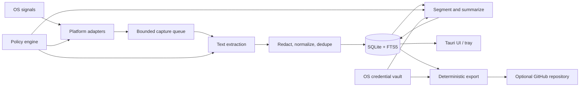

# Architecture

## Stack recommendation

| Layer | Choice | Why |
|---|---|---|
| Desktop shell | Tauri 2 | Small native bundle, Rust integration, tray/autostart/updater support, narrow UI capability model |
| UI | React + TypeScript + Vite | Mature accessible component ecosystem; UI is not on the capture hot path |
| Core runtime | Rust + Tokio | Low steady-state overhead, explicit ownership of ephemeral buffers, strong cross-platform library ecosystem |
| Local store | SQLite in WAL mode + FTS5 | One portable file, transactions, fast time filters and text search, mature recovery tooling |
| Secrets | OS credential vault abstraction | Keychain on macOS, Credential Manager on Windows, Secret Service on Linux |
| Speech | VAD + local Whisper-compatible runtime | Process speech only; configurable model/accelerator; provider interface permits cloud fallback |
| OCR | accessibility APIs, then native OCR/fallback | Avoid pixels and CPU whenever structured text is available |
| Summaries | deterministic segmenter + provider interface | Useful without AI, supports local/BYOK/hosted models without coupling storage to a vendor |

Use Rust for capture, scheduling, extraction, storage, sync, and all permission-
sensitive operations. TypeScript receives only view models and invokes a small
allow-listed command surface. Do not run a general localhost HTTP server in v1.

## Runtime topology



The policy engine is evaluated before capture, before extraction, before a
provider call, and before export. Revocation cancels tasks and drains sensitive
buffers. Each stage has a bounded queue; slow OCR or inference cannot create an
unbounded media backlog.

## Rust workspace boundaries

- `daytrace-core`: timestamps, `ObservationDraft`, source state machine,
  scheduler, policy evaluation, consent receipts, health, and orchestration.
- `daytrace-capture`: traits and capability types; no OS implementation.
- `daytrace-platform-macos`: ScreenCaptureKit, Accessibility, active window,
  idle state, keyboard activity, permissions.
- `daytrace-platform-windows`: Windows Graphics Capture, UI Automation, Win32
  foreground/idle/keyboard hooks, permissions.
- `daytrace-platform-linux`: XDG portals/PipeWire and AT-SPI on Wayland,
  X11-compatible fallback, desktop capability reporting.
- `daytrace-extract`: accessibility tree reduction, OCR interface, VAD,
  transcription, redaction, language detection, hashes.
- `daytrace-store`: migrations, repositories, FTS triggers, retention,
  integrity/backup, query planner tests.
- `daytrace-summary`: activity segmentation, prompt schemas, provider traits,
  evidence mapping, deterministic fallback summaries.
- `daytrace-sync`: Markdown/JSONL rendering, encryption envelope, GitHub client,
  idempotent queue, conflict-free device shards.
- `daytrace-secrets`: secret references and platform vault adapters; callers
  never receive secrets as serializable settings.

Platform crates implement traits such as:

```rust
pub trait CaptureSource {
    fn capabilities(&self) -> CapabilityReport;
    async fn request_permission(&self) -> PermissionState;
    async fn observe(&mut self, trigger: Trigger) -> Result<ObservationDraft>;
    async fn stop(&mut self);
}
```

The actual API should use cancellation-safe concrete types and zeroizing buffer
wrappers; this sketch communicates the boundary, not final compilable code.

## Pipeline contracts

1. `Trigger` contains reason, monotonic time, wall time, source, and policy
   revision.
2. The adapter rechecks permission and policy, then creates a bounded ephemeral
   sample. Screens are single frames; audio uses a ring buffer and capped speech
   chunks.
3. The extractor returns text, language, confidence, and provenance. It cannot
   access the database or network.
4. Redaction applies deny lists, secret patterns, URL policy, length bounds, and
   normalization. Duplicate content becomes a duration update, not another row.
5. One transaction writes the observation and FTS entry, then emits a durable ID
   for the UI/segmenter.
6. Provider calls receive already-selected text segments inside explicit data
   delimiters. Responses must validate against a versioned schema.

Raw buffers must be non-cloneable where practical, bounded, zeroized on drop,
excluded from debug formatting, and never accepted by persistence/logging APIs.

## Cross-platform capability matrix

| Capability | macOS | Windows | Linux |
|---|---|---|---|
| Screen frame | ScreenCaptureKit | Windows Graphics Capture | XDG ScreenCast portal + PipeWire; X11 fallback |
| Structured UI text | Accessibility API | UI Automation | AT-SPI2, app/compositor dependent |
| Foreground window | Accessibility/CG window metadata | Win32 foreground window | compositor-specific on Wayland; X11 where available |
| Microphone | CoreAudio through an audited Rust audio layer | WASAPI | PipeWire/PulseAudio/ALSA through audited layer |
| Keyboard activity | event tap with Input Monitoring consent | low-level keyboard hook in user session | compositor/portal support varies; X11 fallback |
| Browser tabs | optional extension/native messaging | same | same |
| Autostart | signed login item/LaunchAgent path | per-user startup registration | desktop autostart or systemd user unit/package-specific |

Wayland intentionally restricts global observation. Daytrace must show
“unsupported by this desktop” rather than silently weakening security or
falling back to invasive approaches. Browser tabs require an extension because
desktop window APIs do not reliably expose all open tabs.

## Scheduling and efficiency

- Keep the UI webview hidden and quiescent; push coarse status changes instead
  of polling from JavaScript.
- Subscribe to OS focus/idle/device events, debounce them, and use a single
  monotonic timer wheel for maximum-gap deadlines.
- Prefer focused-window accessibility text. Capture pixels only when structured
  text is missing or stale and visual content changed.
- Downscale/crop in GPU/native buffers before CPU OCR where supported.
- Skip inference on duplicate text hashes and silence. Batch FTS writes for a
  short bounded interval while keeping crash-safe transactions.
- Run heavy local inference at low priority and cap concurrency to one task by
  default. Pause it on battery/thermal pressure if configured.
- Checkpoint WAL during idle periods, not during active capture.
- Do not load OCR/STT/LLM models until their source or feature is enabled; unload
  after a configurable idle period.

## Process model decision

Start with one per-user Tauri process containing independent Rust tasks. It is
simpler to sign, obtains permissions in one recognizable app, avoids Windows
service/session isolation, and has the lowest baseline memory. Keep crate and
IPC-ready domain boundaries so capture can become a signed supervised sidecar
later. Split only if soak and fault-injection tests show that UI/webview failure
causes unacceptable capture loss.

## Provider architecture

```text
SummaryProvider
  health() -> ProviderHealth
  estimate(request) -> tokens/cost disclosure
  summarize(request, policy_revision) -> typed SummaryResult

Implementations:
  DeterministicLocalProvider   no model and no network
  OpenAICompatibleProvider     user-selected endpoint/key
  InstalledLocalProvider       localhost runtime managed by user
  DaytraceHostedProvider       authenticated metered gateway, later
```

The provider request stores provider name, model identifier, prompt schema
version, input entry IDs, timestamps, and usage. It never stores the API key.
Cloud requests are disabled until the user passes a disclosure screen and a
test call. A provider cannot query the database directly.

Daytrace must never embed a shared third-party API key in the desktop binary;
native-client secrets can be extracted and abused. “Use a key provided by
Daytrace” therefore means the authenticated `DaytraceHostedProvider` calls a
server-side inference gateway with per-user quotas, revocation, and spend
controls. The upstream provider credential remains on that server.

## Update and diagnostics

Use Tauri's signed updater with TLS endpoints and per-platform signed artifacts.
Diagnostics are local by default and redact paths, titles, journal text, URLs,
transcripts, keys, and tokens. Optional crash reporting must be a separate
consent and send a previewable payload. Release artifacts include checksums,
SBOMs, and third-party notices.

## Primary references

- [Tauri 2 official plugin support](https://v2.tauri.app/plugin/)
- [Tauri autostart plugin](https://v2.tauri.app/plugin/autostart/)
- [Tauri updater](https://v2.tauri.app/plugin/updater/)
- [Apple ScreenCaptureKit](https://developer.apple.com/documentation/screencapturekit)
- [Windows Graphics Capture](https://learn.microsoft.com/en-us/windows/uwp/audio-video-camera/screen-capture)
- [XDG ScreenCast portal](https://flatpak.github.io/xdg-desktop-portal/docs/doc-org.freedesktop.portal.ScreenCast.html)
- [AT-SPI2 development guide](https://gnome.pages.gitlab.gnome.org/at-spi2-core/devel-docs/)
- [SQLite FTS5](https://www.sqlite.org/fts5.html)
- [SQLite WAL](https://www.sqlite.org/wal.html)
